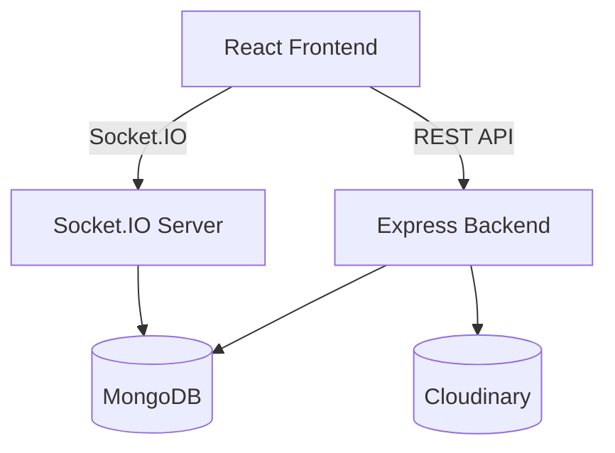

# 💬 Chatly - Real-Time Chat Application

Chatly is a **full-stack real-time chat application** built using the **MERN stack (MongoDB, Express.js, React.js, Node.js)** and **Socket.IO** for instant communication. It enables users to send messages, share images, and view online statuses with real-time updates.

---

## 🧩 Tech Stack

### Frontend

* ⚛️ **React (Vite)** – Component-based UI
* 🎨 **Tailwind CSS** – Modern responsive styling
* 🔁 **Redux Toolkit** – State management
* 🔌 **Socket.IO Client** – Real-time communication

### Backend

* 🧠 **Node.js + Express.js** – RESTful API & WebSocket server
* 🗄️ **MongoDB + Mongoose** – Database & schema management
* ☁️ **Cloudinary** – Image hosting service
* 🧱 **Multer** – File upload handling
* 🔒 **Bcrypt.js** – Password hashing
* 🧩 **CORS, Cookie-parser** – Security and request management

---

## 🚀 Features

* 🔐 User registration and login with JWT authentication
* 💬 Real-time one-to-one chat using Socket.IO
* 🟢 Online user tracking (presence system)
* 🖼️ Image upload via Cloudinary
* 💾 Persistent message storage in MongoDB
* 🔄 State management using Redux
* 🧑‍💻 Responsive and modern UI with Tailwind

---

## 🧱 Project Architecture



---

## 🔁 Message Flow

1. User A sends a message → Socket emits `send-msg`.
2. Backend receives and saves it to MongoDB.
3. Server emits `msg-receive` event to recipient.
4. Receiver’s UI updates instantly.
5. Message persists via REST endpoint for reloads.

---

## 🧩 Folder Structure

```
root/
├── backend/
│   ├── controllers/
│   ├── models/
│   ├── routes/
│   ├── socket/
│   ├── utils/
│   └── index.js
└── frontend/
    ├── src/
    │   ├── components/
    │   ├── redux/
    │   ├── pages/
    │   ├── App.jsx
    │   └── main.jsx
```

---

## 📘 Data Models

### 🧑 User Model

```js
{
  name: String,
  userName: { type: String, unique: true },
  email: { type: String, unique: true },
  password: String,
  image: String,
}
```

### 💬 Message Model

```js
{
  sender: ObjectId,
  receiver: ObjectId,
  text: String,
  image: String,
  createdAt: Date
}
```

### 🗨️ Conversation Model

```js
{
  participants: [ObjectId],
  messages: [ObjectId]
}
```

---

## 🔐 Authentication Flow

1. User signs up → Password hashed with **bcryptjs**.
2. Server generates **JWT token** → Sent via cookie or header.
3. Protected routes use `isAuth` middleware for validation.

---

## ⚡ Socket.IO Real-Time Flow

* `add-user` → Adds user to `userSocketMap`.
* `send-msg` → Emits new message to receiver.
* `getOnlineUsers` → Broadcasts list of active users.
* `disconnect` → Removes user from online map.

---

## ☁️ File Upload Flow

1. Frontend sends multipart form (text + file).
2. Multer handles parsing.
3. File uploaded to Cloudinary.
4. Cloudinary URL saved in MongoDB.

---


## 🧾 License

This project is open-source and free to use for learning and development purposes.

---

## 👨‍💻 Author

**Samagra Jaiswal**
Software Developer | MERN Stack Enthusiast

